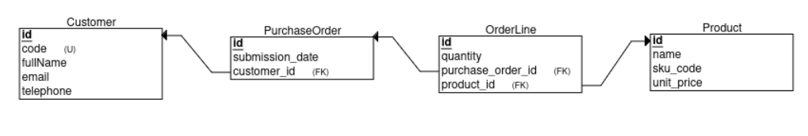
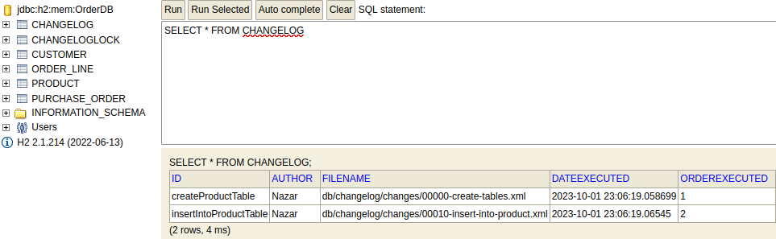

### Relational Model

### Snippet from DB

## Task
MODEL DESCRIPTION: 
- An Order is made of N OrderLine and is related to a Customer, and has a date of submission
- Each OrderLine is made of a Product and a quantity
- A Product has a name, skuCode, unitPrice
- A Customer has a registrationCode, fullName, email, telephone

	DAO LAYER:
	- You can implement it with JDBC and write all methods with relevant SQL 
	- You can use Spring + Hibernate										 
	- You can use Spring Data 												 

	SERVICE LAYER:
	- [X] Implement OrderService, ProductService, CustomerService class with all business logic.

	API:
	- [X] Provide api for following services:
	- [X] Create customer
	- [X] Create product
	- [X] Create order
	- [X] Search all orders by date

	BENEFICIAL FEATURES (TO GET MORE POINTS)

	- [X] Search Orders by product - **partly**, only with JPQL	(using both JPQL and Criteria/Specification queries)
	- [X] Search Orders by customer - **partly**, only with JPQL (using both JPQL and Criteria/Specification queries)
	- [X] Setup Liquibase for database generation/updates
	- [X] Change quantity of products in an order line
	
	TEST DATA:
	- You can generate test data to insert in DB with Mockaroo tool
	- Unit test will give you some additional points - still in progress
